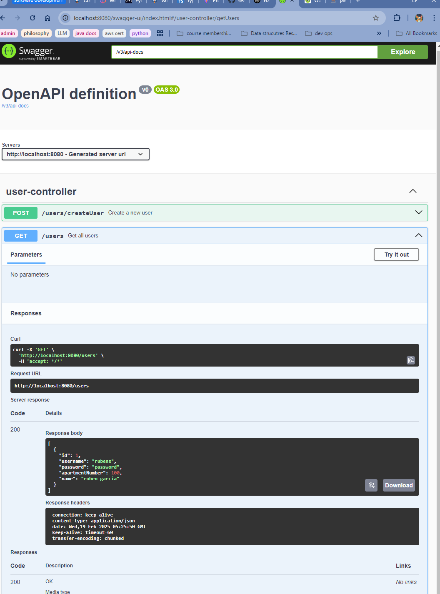
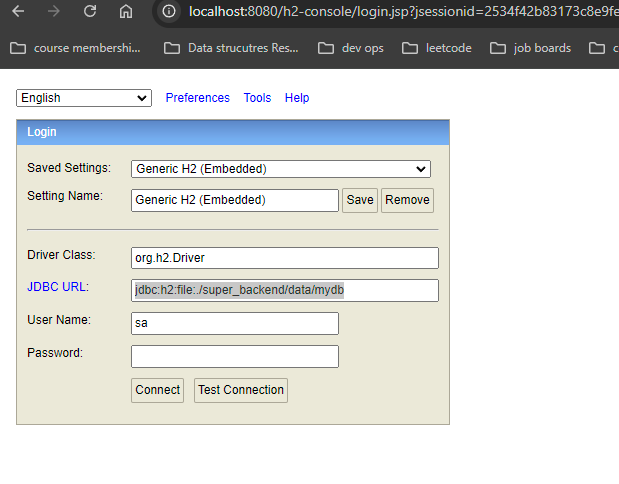
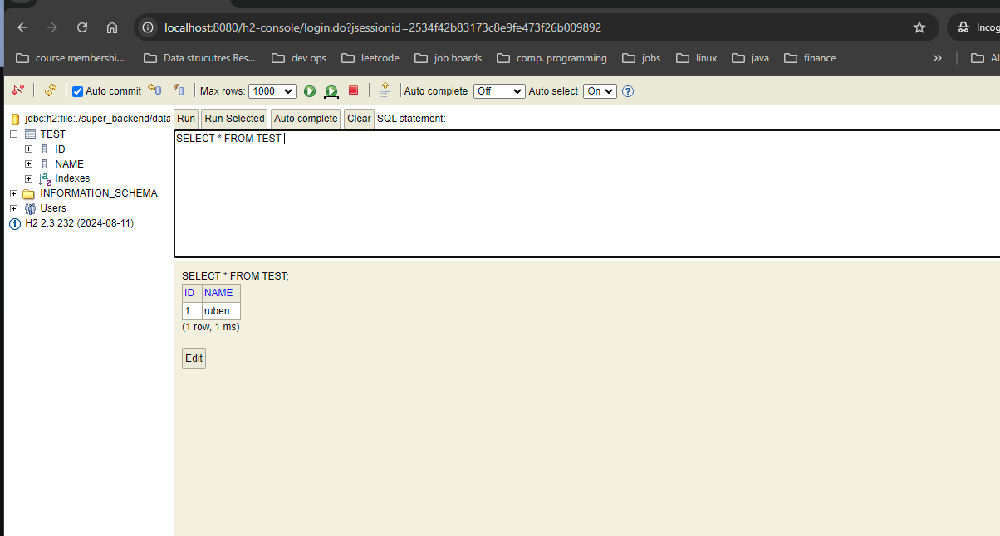

## how to get started
- prereq: ide. I recommend intellij community (free version) https://www.jetbrains.com/idea/download/?section=windows
- java version: 21 
- go to ```super_backend/pom.xml```
- add as a maven project
- run  main method in your ide ```src/main/java/com/example/demo/AppApplication.java```

## using swaggar to view requests 

once the app is running. go to  http://localhost:8080/swagger-ui.html to view the open api definition provided by swagger

try to update your controller methods you add so frontend devs can view https://springdoc.org/

it looks like this 



## to use h2 db to persist while we setup postgres
I added a h2 db to get started persisting and building out your services. Meanwhile we decide where to host our postgres db and backend.
find more info here: https://www.h2database.com/html/main.html , https://howtodoinjava.com/spring-boot/h2-database-example/
after running the spring boot app in 

```src/main/java/com/example/demo/AppApplication.java```

go ahead and run it. once it finished. go ahead to 

``http://localhost:8080/h2-console`` (assuming hosted on port 8080)
you should see: 


and use:
the saved setting: Generic H2 (Embedded)

setting name: Generic H2(Embedded)

driver class: org.h2.Driver

jdbc url: jdbc:h2:file:./super_backend/data/mydb

username: sa

password:

password is a blank space*  

screen should be like this

once you logged in this should be what you see. 

